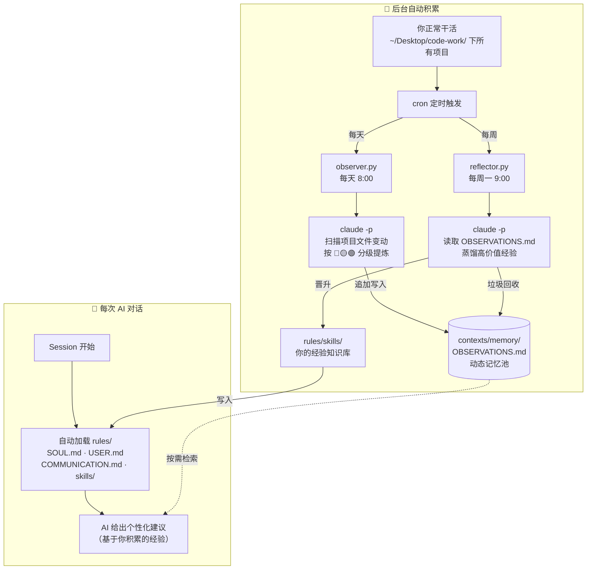

# Context Infrastructure — Reference Implementation

> 背景阅读：[为什么AI只会说正确的废话，以及怎么把它逼出舒适区](https://yage.ai/context-infrastructure.html)

这是一个运行了一年的 context infrastructure 系统的完整结构。主要价值是作为 reference implementation，让你看到系统长什么样、数据如何流动、记忆如何积累。

**核心定位**：这不是开箱即用的工具，而是一个可以参考的蓝图。Clone 下来后，你可以立刻体验「有 context vs 没有 context」的差异。但要让 AI 真正变成你自己的，需要从头采集你的行为数据——没有捷径。

---

## Quick Start（5 分钟）

```bash
git clone https://github.com/grapeot/context-infrastructure
cd context-infrastructure
# 用 Claude Code / OpenCode / Cursor 打开这个目录
```

然后：打开 [`rules/USER.md`](rules/USER.md)，填写你的基本信息。这是 ROI 最高的一步，完成后 AI 的行为立刻个性化。

详细步骤见 [`setup_guide.md`](setup_guide.md)。

---

## 目录结构

```
context-infrastructure/
├── AGENTS.md                    # 根路由表（AI 每次 session 的起点）
├── setup_guide.md               # 配置指引
├── .env.example                 # 环境变量模板
│
├── rules/
│   ├── SOUL.md                  # AI 的身份和行为基调（模板）
│   ├── USER.md                  # 你的偏好和背景（模板）
│   ├── COMMUNICATION.md         # 沟通风格指南（可直接用）
│   ├── WORKSPACE.md             # 目录路由索引
│   ├── axioms/                  # 43 条决策公理（展示层）
│   └── skills/                  # 25+ 个可复用 skill（展示层）
│
├── contexts/
│   ├── memory/
│   │   └── OBSERVATIONS.md      # 三层记忆系统的 L1/L2 层
│   ├── survey_sessions/         # 调研报告存放目录
│   ├── daily_records/           # 日常记录存放目录
│   └── thought_review/          # 思考复盘存放目录
│
├── periodic_jobs/
│   └── ai_heartbeat/
│       ├── docs/
│       │   └── KNOWLEDGE_BASE.md # 观察和反思的 SOP
│       └── src/v0/
│           ├── observer.py      # 每日观察脚本（需配置 cron）
│           └── reflector.py     # 每周反思脚本（需配置 cron）
│
├── tools/
│   ├── semantic_search/         # 语义搜索（Tier 2）
│   └── share_report/            # 报告发布（Tier 2）
│
└── adhoc_jobs/                  # 按需任务存放目录
```

---

## 工作流



---

## 三层结构

**展示层（可以参考，不能复制）**：[`rules/axioms/`](rules/axioms/) 和 [`rules/skills/`](rules/skills/) 包含了这个系统积累一年的内容。43 条公理是从具体经历中蒸馏出来的，skills 是从真实项目中总结的。这些代表原作者的视角，对你有参考价值，但不能替代你自己积累的认知。

**可复用层（直接用）**：[`rules/SOUL.md`](rules/SOUL.md)、[`rules/USER.md`](rules/USER.md) 是模板，填写即可使用。[`rules/COMMUNICATION.md`](rules/COMMUNICATION.md) 是通用的沟通风格指南，大多数人可以直接采用。[`periodic_jobs/ai_heartbeat/`](periodic_jobs/ai_heartbeat/) 提供了记忆系统的实现代码，配合 cron 使用。

**不可复用层**：公理的具体内容、skill 背后的具体经验。理解它们的结构和形成方式，然后从你自己的数据中积累。

---

## License

MIT
